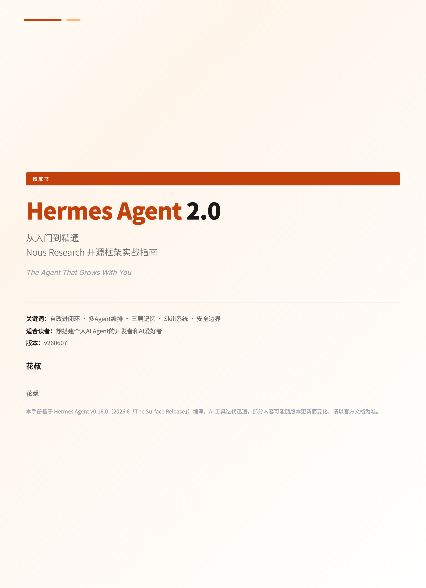
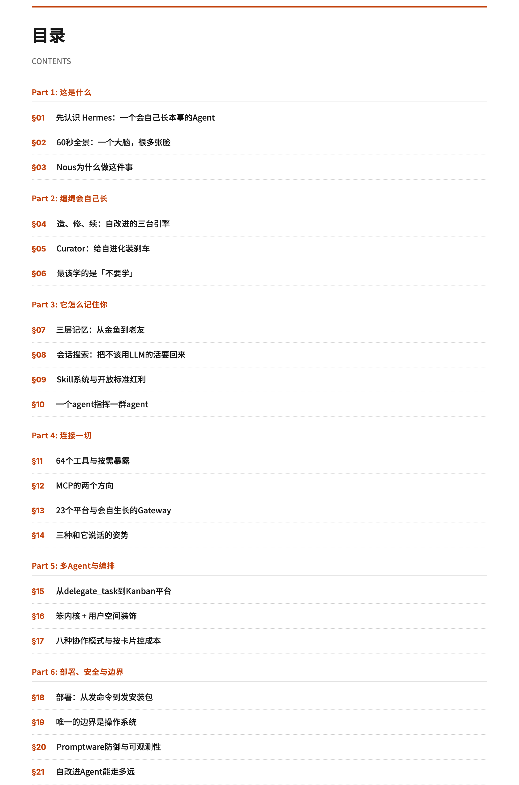
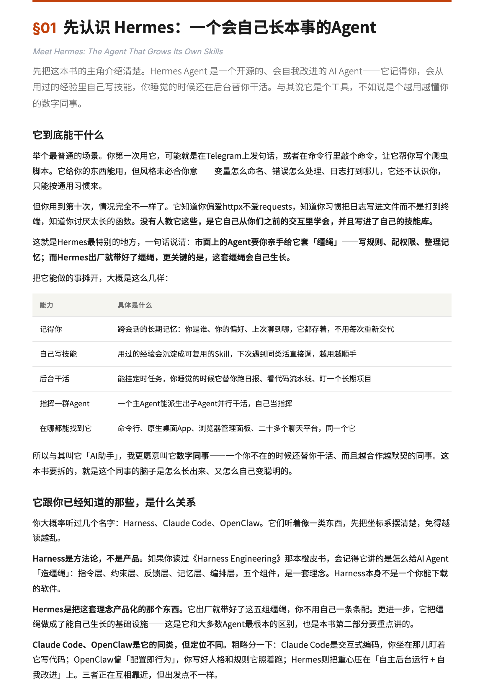
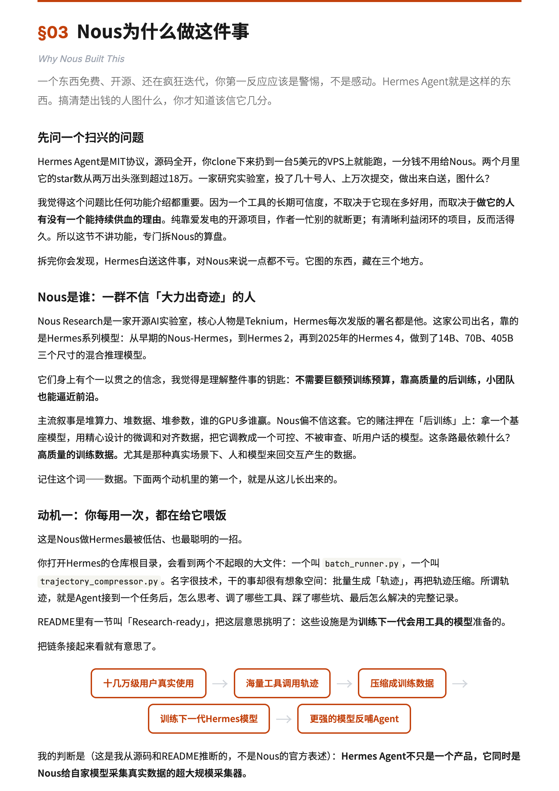

[English](README.md) | **中文**

  
   
  用 <a href="https://github.com/alchaincyf/huashu-design">huashu-design</a> skill 制作

# Hermes Agent橙皮书2.0

> 橙皮书系列 · 花叔 著

[Hermes Agent](https://github.com/NousResearch/hermes-agent) 是 [Nous Research](https://hermes-agent.nousresearch.com/) 开源的 AI Agent 框架——第一个出厂就带缰绳、而且缰绳会自己长大的 Agent。

**这一版是推倒重写。** 第一版基于 Hermes v0.7.0。两个月、九个版本之后，它长出了原生桌面 App、浏览器全套管理面板、23 个消息平台——整个产品换了一张脸，所以这本书围绕 v0.16.0（「The Surface Release」）重新拆了一遍。

  
  

## 下载

| 版本 | PDF |
|------|-----|
| 中文版 | **[PDF 下载](https://github.com/alchaincyf/hermes-agent-orange-book/raw/main/Hermes-Agent橙皮书2.0-v260607.pdf)** |
| English | **[PDF Download](https://github.com/alchaincyf/hermes-agent-orange-book/raw/main/Hermes-Agent-The-Complete-Guide-v260607.pdf)** |

## 这本书讲什么

[Hermes Agent](https://github.com/NousResearch/hermes-agent) 是 Nous Research 开源的 AI Agent 框架。它和 OpenClaw、Claude Code 走的路线不同：内建了自改进学习循环、三层记忆系统、Skill 自动创建和进化机制，这一版还多了持久化的多 Agent 看板平台 Kanban，和一套诚实的、以操作系统为边界的安全模型。

如果你读过《Harness Engineering》橙皮书，Hermes 是那本书讲的五个组件（指令/约束/反馈/记忆/编排）的产品化实现。

**全书 21 节，分 6 个部分：**

| Part | 内容 | 章节 |
|------|------|------|
| 1. 这是什么 | 先认识 Hermes、一个大脑多张脸、Nous 为什么做 | §01-03 |
| 2. 缰绳会自己长 | 自改进三引擎、Curator、最该学的是「不要学」 | §04-06 |
| 3. 它怎么记住你 | 三层记忆、会话搜索、Skill、指挥一群 Agent | §07-10 |
| 4. 连接一切 | 64 个工具、MCP、23 个平台、三种接入面 | §11-14 |
| 5. 多 Agent 与编排 | 从 delegate_task 到 Kanban 平台、八种协作模式 | §15-17 |
| 6. 部署、安全与边界 | 部署、唯一边界是操作系统、Promptware 防御、能走多远 | §18-21 |

  
  

## 适合谁读

- 用过 Claude Code / OpenClaw / Cursor，想了解 Hermes 的开发者
- 不写代码但重度用 AI 的人——Hermes 现在有了桌面 App，这本书也照顾你
- 对 Harness Engineering 概念感兴趣，想看它产品化、还会自我进化的人

## 橙皮书系列

本书是橙皮书系列之一。系列其他书目包括：Claude Code 从入门到精通、Harness Engineering、OpenClaw 等。

所有橙皮书免费下载：**[huasheng.ai/orange-books](https://www.huasheng.ai/orange-books)**

## 关于作者

**花叔** · AI Native Coder · 独立开发者

我一行代码都不会写，却用 AI 做出了 AppStore 付费榜 Top 1 的小猫补光灯，写了 9 本技术书。所有产品全部 AI 写的，我只负责想清楚要做什么。开源了女娲.skill、huashu-design 等项目。

- 公众号：花叔
- B站：[花叔v](https://space.bilibili.com/14097567/)
- X/Twitter：[@AlchainHust](https://x.com/AlchainHust)
- YouTube：[@Alchain](https://www.youtube.com/@Alchain)
- 小红书：[花叔](https://www.xiaohongshu.com/user/profile/5abc6f17e8ac2b109179dfdf)
- 官网：[huasheng.ai](https://www.huasheng.ai/)

## 版本

- **v260607** — 第二版（2.0），基于 Hermes Agent v0.16.0（「The Surface Release」）推倒重写
- **v260408** — 初版，基于 Hermes Agent v0.7.0
- AI 工具迭代迅速，部分内容可能随版本更新变化，请以官方文档为准

## 2.0 的变化

- **推倒重写，不是打补丁。** 从初版的 17 章 / 5 部分，重构为 21 节 / 6 部分，围绕 Hermes v0.16.0 重新解构。新增了自改进闭环（Curator）、多 Agent 看板平台 Kanban、安全模型这些初版几乎没碰的内容。
- **许可证改为 MIT。** 初版用的是 CC BY-NC-SA 4.0。从 2.0 起，本书改用 [MIT 许可证](LICENSE)——你可以自由使用、改编、再分发，包括商用。怎么用得上就怎么用。

## 许可

[MIT 许可证](LICENSE)——可自由使用、复制、修改和分发，包括商用。注明出处更好，但不强制。
